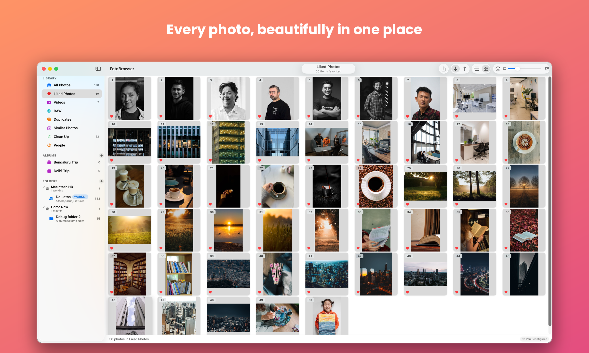
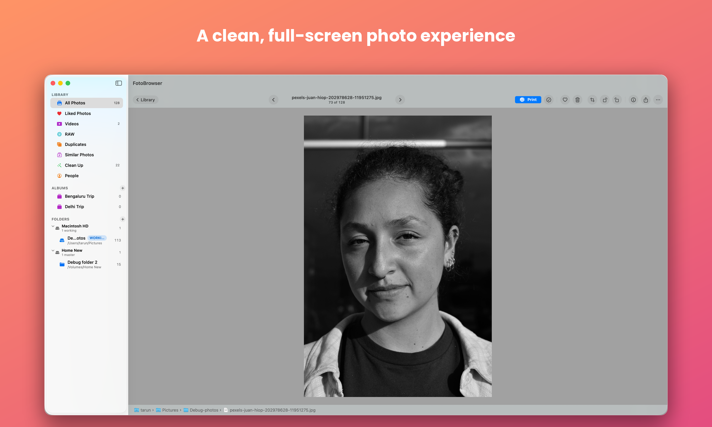
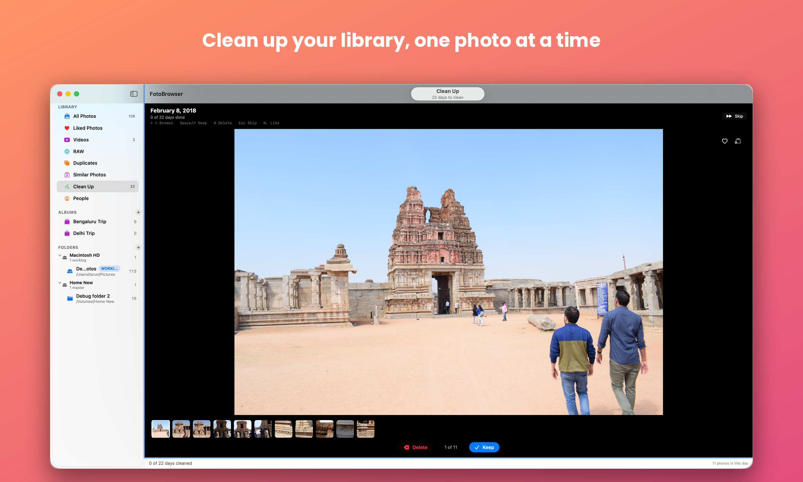
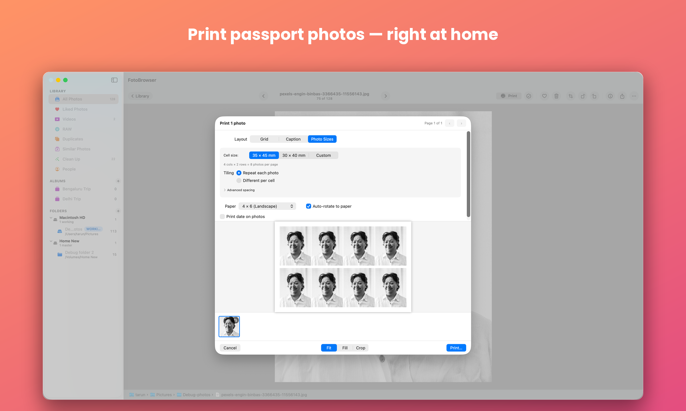
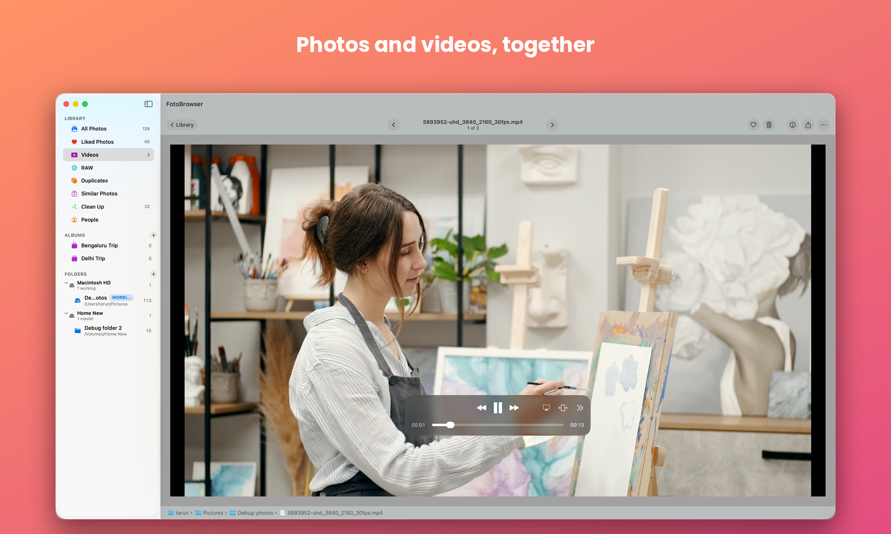

# FotoBrowser

**The Apple Photos feel, over your own folders and backup drives — no library lock-in, no cloud.**

FotoBrowser is a fast, local-first photo browser for Mac. Point it at your folders and
drives and get a clean timeline grid over your pictures, without copying them into a
fragile, proprietary library. Everything runs on your Mac — no account, no cloud required.

> ⚠️ **Alpha** (`0.12.0-alpha`). Usable day-to-day, but expect rough edges. Feedback very welcome.

## Download

➡️ **[Download the latest release](https://github.com/trnchawla/FotoBrowser-pub/releases/latest/download/FotoBrowser.dmg)** (`.dmg`)

Or visit the [landing page](https://trnchawla.github.io/FotoBrowser-pub/).

## Watch the demo

> ▶️ **[The Apple Photos alternative that reads your own folders](https://youtu.be/p2xv_TNXEvs)** — a quick tour of FotoBrowser for Mac.

## Screenshots

**Every photo, beautifully in one place** — a fast timeline or flat grid over your own folders, with watched folders & drive roles in the sidebar.

**A clean, full-screen photo experience** — browse, zoom, and pan with the keyboard; print or share straight from the viewer.

**Clean up your library, one photo at a time** — a focused Keep/Delete review flow, one day or trip at a time.

**Find duplicates and reclaim your space** — detect duplicates across folders and resolve them safely in bulk.

**Print passport photos — right at home** — real photo sizes with tiling; repeat one photo to fill a sheet.

**Photos and videos, together** — MOV, MP4, and M4V indexed alongside your photos, with native playback controls.

## Requirements

- macOS **15 (Sequoia)** or later
- **Universal** — Apple Silicon & Intel

## Install

1. Download the `.dmg`, open it, and drag **FotoBrowser** to **Applications**.
2. Because the alpha isn't notarized yet, macOS blocks the first launch:
   - Double-click the app — it will be blocked with a "not from an identified developer" message.
   - Open **System Settings → Privacy & Security**, scroll down, and click **Open Anyway** next to the FotoBrowser entry.
   - Click **Open** in the confirmation dialog and authenticate with Touch ID or your password.
   - (Alternatively, run `xattr -dr com.apple.quarantine /Applications/FotoBrowser.app` once.)

## Highlights

- 🖼 **Fast timeline grid** with month/year sections and lazy thumbnails — handles large libraries. A **Timeline / Flat** toggle flips any grid to a flat, edge-to-edge layout (remembered per view; curated views like Liked and Albums default to flat).
- 🗂 **Watched folders & drives** — your files are never moved without you. **Rescan Folders** (⌥⌘R, or right-click a folder) re-scans on demand for anything added while the app was open.
- 💾 **Drive roles** — Internal / Master / **Vault** (read-only, never modified).
- 🔌 **Offline-drive aware** — placeholders for disconnected drives, full-res from a connected copy.
- 📱 **Import from iPhone** over USB — copy-only, with a "new since last import" date.
- 🧬 **Duplicate detection** + safe bulk resolve + **Reclaim Space**.
- 🔎 **Find Similar Photos** — perceptual near-duplicate detection (on-device Vision) with quality scoring and a fast keep/trash review.
- 📍 **Places** — see where each photo was taken (city · region · country) from EXIF GPS, via a bundled offline database (no network needed). No GPS? **Set Location by city name** to embed it directly into the original — only the metadata is rewritten, so the picture is copied across untouched. Tagging thousands runs in the background with progress and a Stop button.
- 🕰️ **Set Date/Time** — a scan, screenshot, or wrong-clock photo with no capture time? Right-click ▸ **Set Date/Time** writes a corrected capture date straight into the file's EXIF, just like Set Location does for GPS. Multi-select to stamp one time onto many; like Set Location it rewrites only the metadata, never re-saving the picture. RAW files are left untouched.
- 🧑‍🤝‍🧑 **People** — auto-clusters faces on-device, name a cluster to filter the grid by person, and merge/dismiss/remove tools to correct clustering mistakes.
- 🪄 **Clean Up** — a focused day/trip review flow: Keep/Delete one day (or trip) at a time, with Like and Add-to-Album built in.
- 📷 **RAW & HEIF** — indexes and displays camera RAW files (CR3, CR2, NEF, ARW, RAF, DNG…) and HEIF alongside your JPEGs, using each RAW's embedded preview for fast thumbnails. FotoBrowser never re-encodes a RAW, so originals stay untouched (Set Location isn't available on RAW). A dedicated **RAW** item in the sidebar shows only your camera-RAW files.
- 📹 **Video support** — index, thumbnails, and playback for MOV, MP4, and M4V; hovering shows floating controls without dimming the video.
- ❤️ **Albums & Likes** — organise into albums and mark favourites, shared across every copy of a photo. **Pin** your most-used albums to the top, drag to reorder, tuck the rest under **More Albums**, and **search albums by name**.
- 🖨 **Native printing** — photo sizes and tiling, plus **2-up/4-up grid** and **Instant-film (Polaroid)** layouts with auto spacing and an optional date stamp.
- 📂 **Open from Finder, hand off to Preview** — right-click a photo in Finder ▸ **Open With ▸ FotoBrowser**: photos in your library open in the viewer, photos outside it open read-only with **Print** and **Add to Library**. **Open in Preview** hands a selection to Apple's Preview, **Copy Path** copies file paths, and photos edited elsewhere refresh their thumbnail automatically.
- 📤 **Share & drag out** — Share any selection to AirDrop/Messages/Mail/Save to Files (edits baked in "as seen"), drag photos straight into Finder or another app, and drop a Finder folder onto the sidebar to add it.
- ⚡ **Fast startup & live activity** — the grid paints almost immediately at launch while indexing/analysis refine in the background, and a Background Activity panel shows what's being scanned and indexed (drive › folder · file, with live counts).
- ✏️ **Non-destructive editing** — rotate and crop without ever touching the original file; edits apply **instantly** with no full-library reload, and **Revert to Original** undoes everything at once.
- 🔍 **Zoom in the viewer** — pinch, double-click, or ＋/−/0 to zoom into any photo or Live Photo; drag or the **arrow keys** pan a zoomed shot, and **Esc** snaps back to fit. **Space** opens a photo and toggles back to the grid.
- 🎬 **Live Photos** — shown as photos with native playback that **opens instantly** (the still appears immediately, never a blank wait), plus a grid sort toggle and jump-to-month menu.
- 📦 **Portable library, openable from Finder** — database and thumbnails live in one `.fblibrary` bundle, defaulting to `~/Pictures`, that you can move or back up like any other file. **Double-click a `.fblibrary` in Finder** — even on an external drive — to open or switch to it (now with a custom document icon), or use **Library ▸ Open Library…**.
- 🧹 **Clean folder removal** — optionally purge a removed folder's now-orphaned thumbnails and database rows; shared content and your original files are never touched.
- 🆙 **Update checks** — checks GitHub on launch and shows a banner (with a Download button) when a newer version is ready; check anytime via **Check for Updates…**. No auto-updates.
- ⚡ **Instant delete** — moving photos to Trash is zero-latency; the full-screen viewer stays open and advances to the next photo so you can cull a burst without leaving it. A copy on an **unplugged drive** is queued and trashed automatically when the drive reconnects (review or cancel from a **Pending** sheet), so a deleted photo never resurfaces on re-scan.
- 🔒 **Privacy-first** — your photos never leave your Mac. Anonymous crash reports and aggregate feature analytics help improve the app; no photos, file names, or personal data are transmitted.

## Privacy

FotoBrowser is local-first — your photos stay as ordinary files on your drives and are never uploaded anywhere.

**What is collected:**
- **Crash reports** (Firebase Crashlytics) — anonymous reports if the app crashes, so bugs can be fixed.
- **Anonymous usage analytics** (Firebase Analytics) — aggregate signals like which features are used and error rates. No photos, file names, folder paths, or personally identifiable data.
- **Email (optional)** — share your email to receive update notifications. Opt-in only; change or remove it at any time via **Help ▸ Share Email for Updates…**.

**What is never collected:** photo files, thumbnails, file names, folder paths, or any content from your library.

## Status

This is an early **alpha** — usable day-to-day, but rough edges are expected. See the
[latest release notes](https://github.com/trnchawla/FotoBrowser-pub/releases/latest) for
what's new and current limitations.

## Feedback

Found a bug or have a suggestion? Please
[open an issue](https://github.com/trnchawla/FotoBrowser-pub/issues) with what you tried,
what you expected, and what happened. Thank you for testing!
