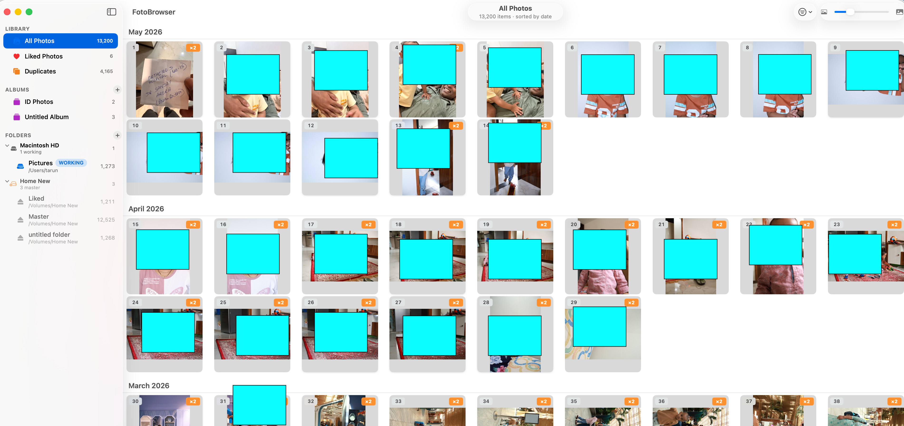
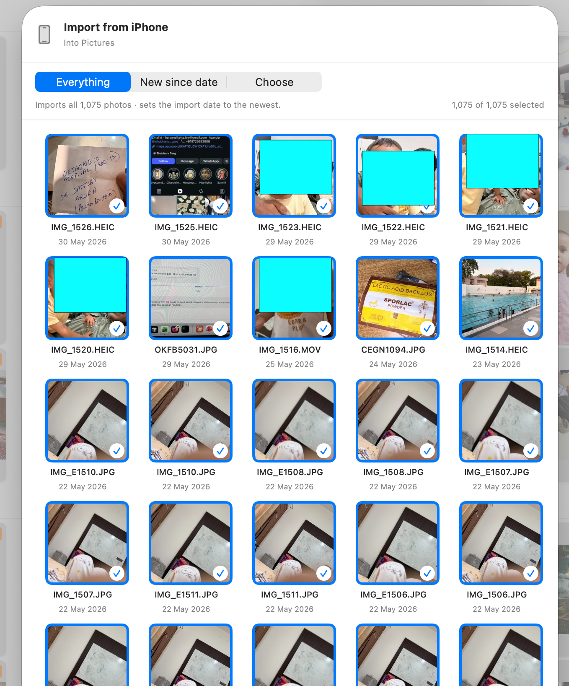
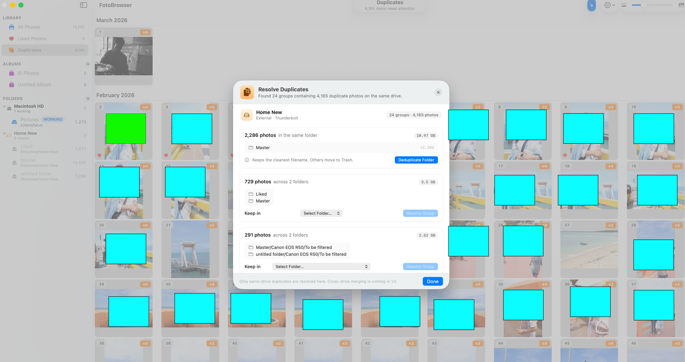
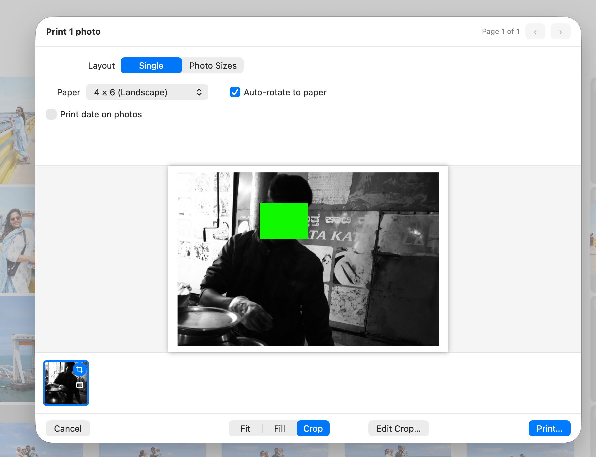
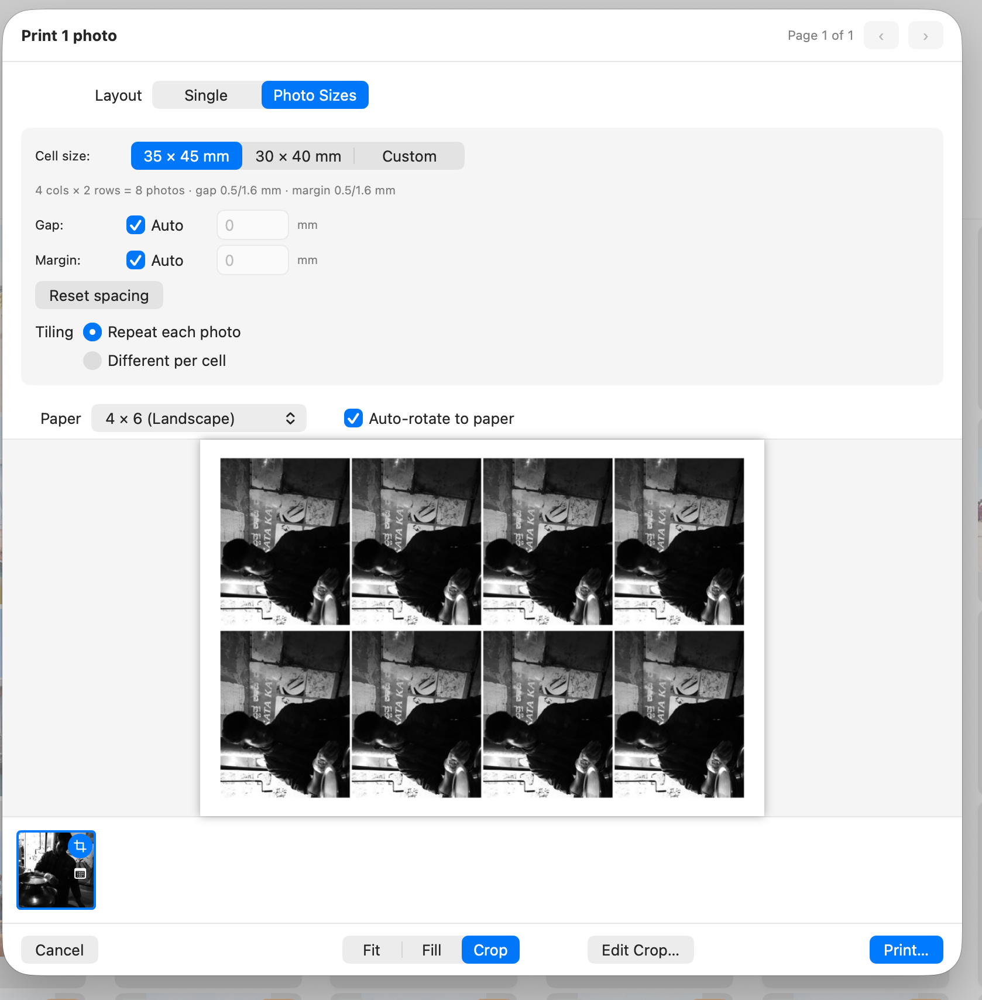

# FotoBrowser

**The Apple Photos feel, over your own folders and backup drives — no library lock-in, no cloud.**

FotoBrowser is a fast, local-first photo browser for Mac. Point it at your folders and
drives and get a clean timeline grid over your pictures, without copying them into a
fragile, proprietary library. Everything runs on your Mac — no account, no cloud, no
telemetry.

## Download

➡️ **[Download the latest release](https://github.com/trnchawla/FotoBrowser-pub/releases/latest/download/FotoBrowser.dmg)** (`.dmg`)

Or visit the [landing page](https://trnchawla.github.io/FotoBrowser-pub/).

## Screenshots

**Timeline grid** — month/year sections, watched folders & drive roles in the sidebar.



**Import from iPhone** — browse the device over USB and import only what's new.



**Duplicate detection** — find duplicates across folders and resolve them safely in bulk.



**Native printing** — print at real photo sizes, with crop…



…or tile multiple copies per sheet.



## Requirements

- macOS **14 (Sonoma)** or later
- **Universal** — Apple Silicon & Intel

## Install

1. Download the `.dmg`, open it, and drag **FotoBrowser** to **Applications**.
2. This alpha isn't notarized yet, so on first launch **right-click the app ▸ Open ▸ Open**
   (only needed once). Alternatively, run:
   ```
   xattr -dr com.apple.quarantine /Applications/FotoBrowser.app
   ```

## Highlights

- 🖼 **Fast timeline grid** with month/year sections and lazy thumbnails — handles large libraries.
- 🗂 **Watched folders & drives** — your files are never moved without you.
- 💾 **Drive roles** — Internal / Master / **Vault** (read-only, never modified).
- 🔌 **Offline-drive aware** — placeholders for disconnected drives, full-res from a connected copy.
- 📱 **Import from iPhone** over USB — copy-only, with a "new since last import" date.
- 🧬 **Duplicate detection** + safe bulk resolve + **Reclaim Space**.
- ❤️ Albums & Likes · ✂️ Crop · 🖨 Native printing (photo sizes, tiling, date stamp).
- 🔒 **100% local** — no cloud, no account, no telemetry.

## Status

This is an early **alpha** — usable day-to-day, but rough edges are expected. See the
[latest release notes](https://github.com/trnchawla/FotoBrowser-pub/releases/latest) for
what's new and current limitations.

## Feedback

Found a bug or have a suggestion? Please
[open an issue](https://github.com/trnchawla/FotoBrowser-pub/issues) with what you tried,
what you expected, and what happened. Thank you for testing! 🙏
